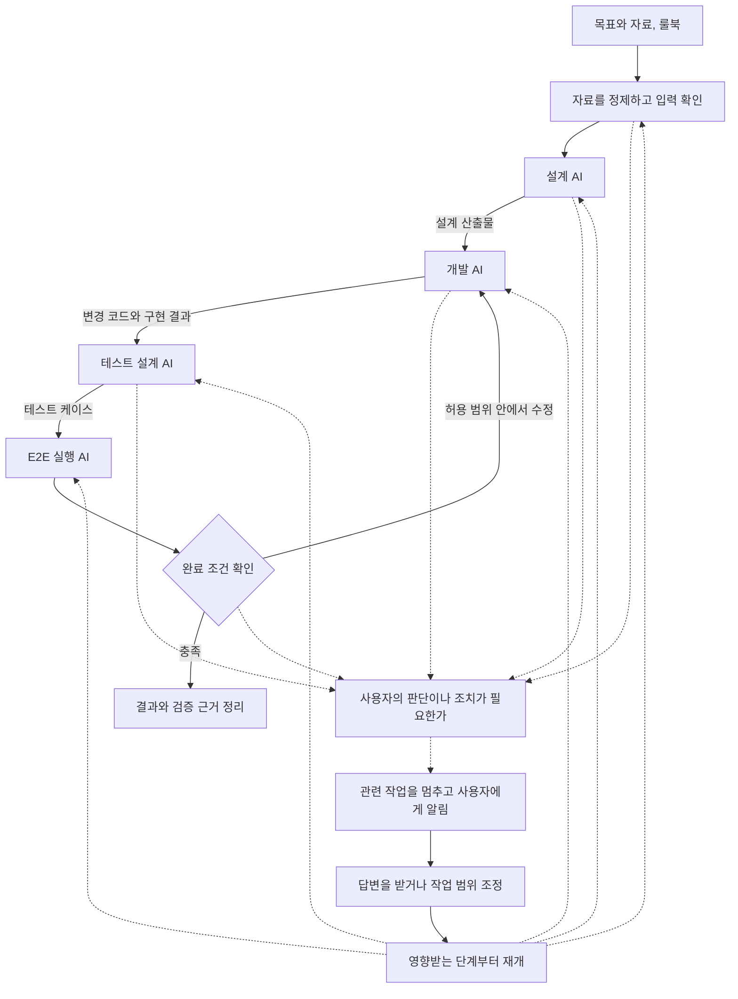

# CODAST (코다스트)

**설계부터 개발과 테스트까지, AI에게 맡긴 작업이 다음 작업으로 이어지도록.**

CODAST는 **여러 AI에게 개발 작업을 나누어 맡기고, 결과를 다음 담당 AI에게 전달하기 위해 개발 중인 개인용 로컬 오케스트레이션 도구**입니다. 설계 자료를 넣으면 설계와 개발, 테스트를 이어서 진행하고, 사람의 판단이 필요할 때 잠시 멈췄다가 답변을 받아 계속하는 것이 목표입니다.

개발자는 목표와 자료를 준비하고 사용할 AI와 작업 규칙을 정합니다. AI는 정해진 범위에서 작업을 이어갑니다. 필요한 정보가 없거나 중요한 결정을 내려야 할 때, 보호 규칙에 걸렸을 때는 이유와 선택지를 정리해 사용자에게 알리도록 설계합니다.

> **목표 실행 구조를 구체화하고 검증하는 초기 단계입니다.** 현재는 AI 연결과 세션 관리, 룰북 전달, 첨부 데이터 가드, 사용자 답변을 받아 작업을 이어가는 기능을 구현했습니다. 단계별로 AI를 자동 실행하고 결과를 검증해 넘기는 기능과, 규칙에 따라 승인을 기다리거나 수정 작업으로 돌아가는 기능은 앞으로 구현합니다.

## 왜 만드는가

여러 AI를 개발에 활용할 때, 각 AI의 작업 사이에는 사람이 맡는 일이 남습니다.

설계 AI의 응답을 기다리고, 결과를 읽어 개발 지시서로 정리하고, 다른 AI에게 원본 자료와 함께 전달합니다. 개발이 끝나면 변경 내용을 다시 정리해 테스트를 요청합니다. 테스트가 실패하면 로그와 기대 동작을 모아 개발 담당 AI에게 돌려보냅니다. 세션이 바뀌면 이전 결정과 진행 상황도 다시 설명해야 합니다.

**CODAST는 사람이 매번 결과를 기다렸다가 읽고, 복사해서 다음 AI에게 다시 설명하는 수고를 줄이려 합니다.** 개발자가 목표와 완료 조건을 정한 뒤에는 필요한 판단에 집중할 수 있도록 만드는 것이 이 프로젝트의 연구 목적입니다.

첫 사용 대상은 자신의 PC에서 여러 AI 코딩 에이전트를 활용하는 개발자 개인입니다. 프로젝트 자료와 기록을 로컬에서 관리하고, 실제 개발 작업에서 유용성을 확인하는 것을 우선합니다. AI 요청은 연결된 에이전트의 모델 서비스로 전달됩니다.

## 목표 사용 시나리오

요구사항과 화면설계서, API 명세, DB 테이블 정의를 넣고 “회원 관리 기능을 구현하고 검증해줘”라고 요청하는 상황을 예로 들 수 있습니다. 단계별 에이전트와 모델은 작업에 맞게 지정합니다.

| 단계 | 담당 예시 | 다음 단계에 넘길 내용 |
| --- | --- | --- |
| 설계 | Codex + 선택한 설계 모델 | 구현 범위, 화면과 API 및 DB 설계, 결정 사항과 원문 근거 |
| 개발 | Claude Code + 선택한 개발 모델 | 설계에 따른 코드 변경, 실행 방법, 미해결 사항 |
| 테스트 케이스 설계 | Codex + 선택한 검증 모델 | 요구사항별 정상 동작, 오류와 경계 조건, 기대 결과 |
| E2E 검증 | Claude Code + 선택한 테스트 모델 | 테스트 결과, 실패 재현 절차, 로그와 관련 변경 |
| 수정 후 재검증 | 해당 단계의 담당 에이전트 | 실패 원인에 맞는 보완과 재검증 결과 |

위 배정은 목표 흐름의 예시이며 현재 자동 연결 기능이나 특정 모델의 우수성을 뜻하지 않습니다. 작업에 따라 단계를 생략하거나 같은 에이전트가 여러 단계를 맡을 수 있습니다.



위 그림은 앞으로 구현할 작업 흐름입니다. 각 단계에서 받은 자료와 만든 결과, 완료 조건과 버전을 기록해 다음 AI가 무엇을 바탕으로 작업할지 알 수 있게 합니다. 테스트가 실패하면 로그와 재현 절차를 담당 AI에게 전달하고, 허용된 범위와 재시도 횟수 안에서 고친 뒤 다시 검증하도록 만들 예정입니다.

## 자율 진행과 사용자 개입

**일상적인 작업은 AI에게 위임하고, 사람의 판단이 필요한 지점에서만 흐름을 멈추는 것**이 기본 방향입니다. 사용자는 실행 중에도 중단하거나 방향을 수정할 수 있어야 합니다.

| 상황 | 목표 동작 |
| --- | --- |
| 합의한 범위 안에서 진행할 수 있음 | 사용자 확인 없이 다음 작업으로 진행 |
| 진행 상황이나 결과를 알려야 함 | 작업은 계속하고 알림만 전달 |
| 필요한 자료나 정보가 없음 | 질문하고, 답변이 필요한 작업만 대기 |
| 중요한 설계를 바꾸거나 승인받은 범위를 넘어야 함 | 변경 이유와 대안, 영향을 설명하고 결정 대기 |
| 보호 규칙에 걸리거나 허용한 횟수만큼 시도해도 실패함 | 해당 작업을 멈추고 원인과 필요한 조치 안내 |
| 사용자가 답하거나 작업 방향을 바꿈 | 결정 내용을 기록하고 관련 단계부터 다시 진행 |

판단 기준은 [공통 개발 가이드](docs/development-guide.md)와 프로젝트 룰북에 둡니다. 규칙을 프롬프트로 전달하는 것에 더해, 시스템이 검사할 수 있는 조건은 코드로 확인하고 AI의 판단이 필요한 조건은 근거와 함께 검토하도록 구성하는 것이 목표입니다. **답변이 없거나 시간이 지났다는 이유로 승인된 것으로 처리하지 않습니다.**

## 작업을 이어가기 위해 필요한 것

- **에이전트 연결과 세션 관리:** 단계별 담당과 작업 경로를 연결하고, 이전 세션을 이어가거나 필요한 맥락으로 새 작업을 시작합니다.
- **산출물 인계와 프로젝트 지식:** 요구사항부터 설계, 코드, 테스트까지 출처와 버전을 연결하고 다음 작업에 필요한 부분을 전달하는 기능을 개발합니다.
- **데이터 가드:** 첨부 자료를 로컬에서 추출한 뒤 검사하고 정책에 따라 가공합니다. 현재는 첨부 경로에 적용하며 전체 도구 접근을 통제하는 기능은 아닙니다.
- **실행 기록과 복구:** 어떤 입력과 규칙으로 실행했는지 기록하고 중복 실행을 막으며, 작업을 중단하거나 서버를 다시 시작한 뒤에도 상태를 확인할 수 있게 합니다.

CODAST가 담당하는 영역은 에이전트 사이의 작업 조정입니다. 모델에 요청하고 파일을 수정하거나 도구를 실행하는 과정은 Codex와 Claude Code의 실행 하네스가 담당합니다. 현재 코드의 책임 경계는 [구조 분석](docs/harness-architecture.md)에 정리했습니다.

## 설계 방향과 근거

전체 작업의 순서와 진행 상태는 CODAST가 관리하고, 각 단계 안에서의 개발 작업은 에이전트에게 위임하는 방향으로 설계합니다. 다음 단계로 넘어갈 때는 응답뿐 아니라 산출물의 버전과 결정 사항, 완료 조건을 확인한 근거를 전달합니다. 시각화와 보고서 생성은 작업에 따라 선택하는 기능입니다.

이 방향은 [Anthropic의 워크플로와 단계별 검사 설명](https://www.anthropic.com/engineering/building-effective-agents), [OpenAI의 오케스트레이션 책임 구분](https://developers.openai.com/api/docs/guides/agents/orchestration), [Anthropic의 실제 결과 중심 평가](https://www.anthropic.com/engineering/demystifying-evals-for-ai-agents)를 참고해 도출했습니다. 특정 업체의 표준 구조를 구현했다는 의미는 아닙니다. 자료의 적용 범위, 대안과 선택 이유, 첫 검증 계획은 [작업 오케스트레이션의 목적과 설계 근거](docs/orchestration-design.md)에 정리했습니다.

## 연구 질문과 평가

**개발 과정을 AI에게 대부분 위임하면서도, 필요한 사용자 개입을 놓치지 않고 작업을 끝낼 수 있는가?**

같은 자료와 완료 조건을 정해 두고, 한 에이전트에게 전체 작업을 맡기는 경우와 사람이 여러 AI 사이에서 직접 일을 넘기는 경우를 기준으로 비교할 계획입니다.

- 결과를 정리해서 다음 AI에게 전달하는 데 사람이 쓴 시간과 개입 횟수
- 질문하거나 승인을 받아야 할 때 놓친 횟수, 필요 없이 멈춘 횟수
- 다음 AI에게 넘기면서 빠뜨린 요구사항이나 잘못 전달한 버전 때문에 다시 한 작업
- 사용자 답변이나 실행 중단 이후 올바른 단계에서 다시 시작했는지
- 완성된 결과가 요구사항과 테스트를 충족했는지, 총 시간과 토큰은 얼마나 들었는지

초기 자료 처리와 추가 모델 호출 비용도 포함합니다. 현재는 평가 계획이며 자동화 효과나 비용 절감 수치를 입증한 상태는 아닙니다.

## 현재 개발 상태

| 영역 | 현재 구현 | 남은 핵심 작업 |
| --- | --- | --- |
| 에이전트 실행 | Codex와 Claude Code 실행, 모델과 권한 설정, 취소와 진행 상황 수신 | 단계마다 담당 AI와 모델을 지정하고 다음 작업 자동 실행 |
| 세션과 기록 | 채팅과 AI 세션 연결, 기록 저장과 재개, 중복 요청 방지 | 어느 단계에서 어떤 결과와 결정으로 작업했는지 확인하고 재개 |
| 자료와 데이터 가드 | 지원 문서의 제한된 텍스트 추출, 보호 정책, 미리보기와 처리 이력 | 자료의 관계와 출처, 버전을 관리하고 단계에 맞는 입력 준비 |
| 사용자 개입 | 룰북 전달, 정해진 형식의 질문을 저장하고 답변 후 재개, 실행 종료 알림 | 규칙에 따라 진행하거나 대기, 승인 내역 관리와 CLI 승인 요청 연결 |
| 완료 판단 | 실행 결과와 오류 저장 | 요구사항과 테스트 결과로 완료를 판단하거나 수정 단계로 복귀 |

현재 `completed`는 에이전트 호출이 정상 종료됐다는 뜻입니다. 워크플로 전체의 완료 조건 충족이나 테스트 성공을 별도로 판정한 상태는 아닙니다. 현재 기반의 상세 계약은 [실행 동작](docs/client-runtime.md), [첨부 가드](docs/data-guard.md), 앞으로의 작업은 [개발 계획](docs/TODO.md)을 참고하세요.

## 기술 스택

| 영역 | 기술 |
| --- | --- |
| Backend | Python 3.12+, FastAPI, Pydantic, Uvicorn |
| Frontend | JavaScript, HTML, CSS, SSE |
| Database | SQLite |
| AI 연동 | Codex CLI, Claude CLI |
| 문서 처리 | detect-secrets, openpyxl, python-docx, python-pptx |
| 테스트 | pytest, Node.js test runner, 브라우저 검증 스크립트 |
| 의존성 관리 | uv |

## 시작하기

Python 3.12+와 uv가 필요합니다. 실제 AI 실행에는 사용할 Codex 또는 Claude CLI의 설치와 로그인이 필요합니다. 현재 검증 환경은 Windows입니다.

저장소 루트에서 실행합니다.

```powershell
uv sync --frozen
uv run start.py
```

브라우저에서 [http://127.0.0.1:8765](http://127.0.0.1:8765)를 엽니다. 서버 종료는 터미널에서 Ctrl+C입니다. 실행 상태를 한 프로세스에서 관리하므로 다중 worker와 실행 중 자동 reload는 사용하지 않습니다.

### 사용 방법

1. 에이전트 연결 화면에서 CLI 설치와 로그인 상태를 확인합니다.
2. 프로젝트를 생성하거나 기존 작업 폴더를 등록합니다.
3. 채팅을 만들고 에이전트와 모델, 작업 경로와 권한을 선택합니다.
4. 필요한 파일을 클립 버튼이나 드래그앤드롭으로 첨부하고 요청을 보냅니다.
5. 저장된 채팅 또는 기존 CLI 세션을 열어 작업을 이어갑니다.

### 데이터 저장 위치

| 환경 변수 | 기본값 | 설명 |
| --- | --- | --- |
| `HARNESS_WORKSPACES` | `workspaces/` | 프로젝트 저장 위치 |
| `HARNESS_DB` | `workspaces/.harness/harness.sqlite3` | 실행 기록 DB. 워크스페이스 경로를 변경하면 해당 경로 아래에 생성 |

경로를 변경해도 기존 데이터가 자동으로 이동하지는 않습니다. 개인 설정과 인증 정보, 실행 DB는 Git에 포함하지 않습니다.

## 프로젝트 구조

```text
app/
  api/        HTTP API와 이벤트 스트림
  core/       실행 조정, 세션, 저장소, 규칙, 첨부 자료 처리
  llm/        AI CLI 어댑터
  models/     공통 데이터 모델
  tools/      파일 시스템 도구
  web/        웹 화면과 정적 파일
docs/         개발 문서와 검증 기록
tests/        자동 테스트와 브라우저 검증
start.py      로컬 서버 실행
```

브라우저 요청은 API와 실행 조정 계층을 거쳐 CLI 어댑터로 전달됩니다. 대화와 실행 이벤트는 SQLite에 저장하고, 실행 중 출력은 SSE로 브라우저에 전달합니다. 설계와 검증 근거는 [구현 노트](docs/implementation-notes.md)에 정리했습니다.

## 테스트

```powershell
uv run --frozen pytest -q
node --test tests/*.cjs
```

브라우저 검증 스크립트는 `tests/browser/`에 있습니다. 실제 CLI를 사용한 세션을 이어가거나 복원한 검증 기록은 [문서 목록](docs/README.md#검증-기록)에서 확인할 수 있습니다.

## 지원 범위

로컬 단일 사용자 환경에서 프로젝트별 한 실행을 지원합니다. 실행의 `completed`는 에이전트 호출의 정상 종료를 뜻하며, 요구사항 충족이나 테스트 통과를 앱이 별도로 판정한 상태는 아닙니다. Codex의 실제 세션 재개와 DB 복원을 검증했으며, Claude의 실제 모델 재개는 추가 검증이 필요합니다. 취소는 이미 변경된 파일을 되돌리지 않습니다.

첨부 보호는 추출한 첨부 텍스트에 적용하며 CLI의 직접 파일 읽기까지 차단하지는 않습니다. 형식별 한도와 보호 범위는 [첨부 자료 가드](docs/data-guard.md)를 참고하세요.

## 문서

- [전체 문서](docs/README.md)
- [작업 오케스트레이션의 목적과 설계 근거](docs/orchestration-design.md)
- [오케스트레이션과 실행 하네스의 책임 경계](docs/harness-architecture.md)
- [CLI 연결 안내](docs/connection-scenarios.md)
- [세션과 실행 동작](docs/client-runtime.md)
- [개발 가이드](docs/development-guide.md)
- [개발 계획](docs/TODO.md)
