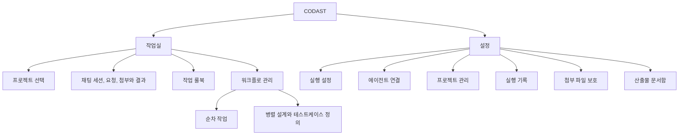
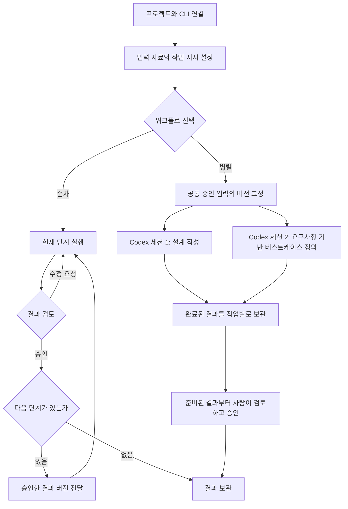

# CODAST

CODAST는 Codex와 Claude Code의 작업 지시, 자료, 결과와 실행 기록을 관리하는 개인용 로컬 작업 공간입니다.

## 설치와 실행

Python 3.12 이상과 uv가 필요합니다. 실제 AI 실행에는 사용할 Codex 또는 Claude Code CLI를 별도로 설치하고 인증해야 합니다.

```powershell
uv sync
uv run python start.py
```

브라우저에서 http://127.0.0.1:8765 에 접속한 뒤 사용할 CLI를 연결하고 프로젝트를 등록합니다.

## 주요 기능

- 프로젝트별 채팅, 실행 기록, 스트리밍, 취소와 초안 복원
- 첨부 자료 처리와 산출물 문서함, 결과 버전 검토와 승인
- 승인한 결과 버전을 다음 단계로 전달하는 순차 워크플로
- 같은 승인 입력으로 Codex 설계와 테스트케이스 정의를 동시에 실행하는 읽기 전용 병렬 워크플로

## 화면 구조 (IA)

작업실에서 요청과 결과를 확인하고, 설정에서 실행 환경과 자료 보관을 관리합니다. 아래는 주요 화면과 기능의 관계입니다.


```mermaid
flowchart TD
    App[CODAST] --> Workspace[작업실]
    App --> Settings[설정]
    Workspace --> Project[프로젝트 선택]
    Workspace --> Chat[채팅 세션, 요청, 첨부와 결과]
    Workspace --> Rules[작업 룰북]
    Workspace --> Workflow[워크플로 관리]
    Workflow --> Sequential[순차 작업]
    Workflow --> Parallel[병렬 설계와 테스트케이스 정의]
    Settings --> Execution[실행 설정]
    Settings --> Agents[에이전트 연결]
    Settings --> Management[프로젝트 관리]
    Settings --> History[실행 기록]
    Settings --> Protection[첨부 파일 보호]
    Settings --> Documents[산출물 문서함]
```

## 작업 흐름

일반 채팅에서는 지시를 보내고 실행 결과를 확인합니다. 워크플로에서는 입력 자료와 작업을 설정한 뒤 결과를 검토하고 승인합니다.


```mermaid
flowchart TD
    Setup[프로젝트와 CLI 연결] --> Input[입력 자료와 작업 지시 설정]
    Input --> Mode{워크플로 선택}
    Mode -->|순차| Run[현재 단계 실행]
    Run --> Review{결과 검토}
    Review -->|수정 요청| Run
    Review -->|승인| Next{다음 단계가 있는가}
    Next -->|있음| Handoff[승인한 결과 버전 전달]
    Handoff --> Run
    Next -->|없음| Done[결과 보관]
    Mode -->|병렬| Approved[공통 승인 입력의 버전 고정]
    Approved --> Design[Codex 세션 1: 설계 작성]
    Approved --> Cases[Codex 세션 2: 요구사항 기반 테스트케이스 정의]
    Design --> Results[완료된 결과를 작업별로 보관]
    Cases --> Results
    Results --> Human[준비된 결과부터 사람이 검토하고 승인]
    Human --> Done
```

병렬 테스트케이스 정의는 설계 결과를 기다리지 않습니다. 질문, 실패와 취소는 작업별로 처리하며 완료된 다른 결과는 유지합니다.

## 개발

```powershell
uv run python -m pytest -q
```

개발 규칙은 [AGENTS.md](AGENTS.md), 작업 요청 양식은 [작업 지시서 예시](docs/task-request-example.md)를 참고하세요.
