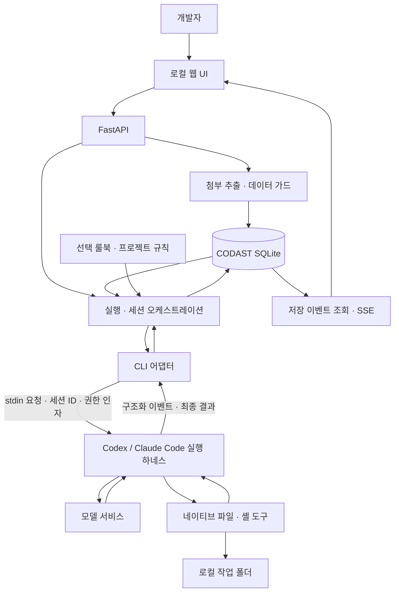

# CODAST 오케스트레이션과 실행 하네스의 책임 경계

2026-09-19 기준 공식 자료와 현재 소스를 대조한 구조 분석입니다. 아래 분류는 이 프로젝트를 설명하기 위한 해석이며 업체들이 합의한 표준 분류나 인증을 뜻하지 않습니다. 코드 구조를 변경하는 제안과 현재 구현 설명을 구분합니다.

## 결론

**CODAST(코다스트)는 기존 코딩 에이전트의 실행 하네스를 연동하는 개인용 로컬 개발 오케스트레이션 도구**입니다. 프로젝트 컨텍스트, 첨부 데이터 가드, 실행 및 세션 관리를 직접 담당합니다. 이 문서에서 제품은 CODAST, 모델과 도구의 실행 루프를 제공하는 Codex와 Claude Code의 기반은 실행 하네스로 구분합니다.

핵심 구분은 세 가지입니다.

1. **CODAST 오케스트레이션 애플리케이션:** 작업 입력, 자료, 규칙, 실행 접수와 기록, 사용자 상호작용을 관리합니다. 현재 우리가 만드는 영역입니다.
2. **에이전트 실행 하네스:** 모델 호출 → 도구 실행 → 결과 반영을 반복하며 네이티브 대화와 도구 사용을 관리합니다. 현재 Codex·Claude Code에 맡기는 영역입니다.
3. **실행 환경:** 파일·프로세스·네트워크가 실제로 존재하는 환경입니다. 현재는 사용자 PC의 작업 폴더와 CLI 실행 환경을 사용합니다. 폴더 선택 자체가 OS 격리를 만들지는 않습니다.

## 공식 자료에서 사용하는 의미

| 자료 | 설명의 중심 | 우리 구조에 적용한 해석 |
| --- | --- | --- |
| [OpenAI: Codex as a platform](https://developers.openai.com/blog/codex-as-a-platform) | Codex의 실행 하네스와 이를 제품에 연결하는 애플리케이션의 역할 분리 | 애플리케이션이 프로젝트 맥락을 준비하고 기존 에이전트 실행 기반을 재사용하는 패턴에 해당 |
| [OpenAI: Agents API architecture](https://developers.openai.com/api/docs/guides/agents-api/architecture) | 서비스가 실행하는 하네스, 명령이 실행되는 환경, 제품을 연결하는 애플리케이션 서버 구분 | 같은 책임을 비교할 수 있지만 현재 우리는 이 API를 사용하지 않음 |
| [Anthropic: Managed Agents](https://www.anthropic.com/engineering/managed-agents) | 세션 기록·하네스·샌드박스를 분리해 교체·복구·확장하는 관리형 기반 | 세션·실행 복구 문제는 겹치지만 운영 범위와 격리 구조는 다름 |
| [Anthropic: 장기 작업 하네스](https://www.anthropic.com/engineering/effective-harnesses-for-long-running-agents) | 기존 Agent SDK에 작업 진행 기록과 검증·세션 인계를 결합 | 기존 실행 하네스 위에 목적별 개발 흐름을 추가할 수 있다는 근거 |

OpenAI는 Codex 하네스가 대화 상태·도구 실행·설정된 권한 정책 등을 담당하고, 이를 사용하는 제품이 자신의 맥락과 업무 기능을 소유하는 구조를 설명합니다. 연결 수단으로 exec·SDK·app-server를 구분합니다. 이 책임 분리가 현재 프로젝트를 설명하는 데 적합합니다. 다만 공식 예시의 승인 처리나 도구 노출 기능을 우리 구현이 모두 제공하는 것은 아닙니다. [공식 설명](https://developers.openai.com/blog/codex-as-a-platform)

Anthropic Managed Agents는 하네스의 상위·하위 버전 순서라기보다 실행 기반의 배치와 운영을 다루는 서비스입니다. 세션을 실행 주체와 분리하고 샌드박스를 교체 가능하게 만드는 내용이 중심입니다. 따라서 우리 로컬 앱을 그대로 확장하면 같은 제품이 된다고 해석하지 않습니다. [공식 설명](https://www.anthropic.com/engineering/managed-agents)

## 현재 실행 구조

이 그림은 실제 구현 경로를 나타냅니다. 자료 관계 색인이나 다단계 자동 개발 흐름은 포함하지 않았습니다. MCP는 에이전트 설정에 따라 도구 연결에 사용될 수 있으며 우리 앱이 직접 운영하는 MCP 서버는 이 경로에 없습니다.

### 코드와 책임 대응

| 책임 | 현재 코드 | 구현과 경계 |
| --- | --- | --- |
| 실행 준비와 조정 | [Orchestrator](../app/core/orchestrator.py)의 `prepare`, `submit`, `perform` | 경로·에이전트 선택, 컨텍스트 준비, 실행 제한·중복 접수 처리, 비동기 실행, 결과 저장 |
| 입력 컨텍스트 | [ContextBuilder](../app/core/context_builder.py), [RuleLoader](../app/core/rule_loader.py), `prepare` | 규칙·선택 자료·최근 대화의 문자 예산 구성. 관계 검색·의미 기반 지식 회수·네이티브 컨텍스트 압축은 별개 |
| 첨부 데이터 가드 | [Materials](../app/core/materials.py), [추출](../app/core/material_extract.py), [탐지 정책](../app/core/data_guard.py) | 업로드 시 정제, 선택 시 프로젝트·정책 지문 확인, 실행별 감사 기록. [적용 경계](data-guard.md)는 첨부 경로 |
| 에이전트 호출 | [CliAdapter / ProcessRunner](../app/llm/cli.py) | Codex `exec --json`/`exec resume`, Claude `-p`/`--resume` 호출과 이벤트 해석. 개별 모델 호출·도구 실행 루프는 CLI 내부 |
| 상태 저장·브라우저 복원 | [Storage](../app/core/storage.py), [API](../app/api/routes.py) | 채팅·실행·이벤트·세션 연결 저장과 SSE 재전송. 네이티브 세션 저장소 전체를 복제하지 않음 |
| 질문 후 이어가기 | `Orchestrator.reply`, [질문 계약](../app/core/questions.py) | 정해진 응답 형식의 질문에 답변하면 후속 실행. 네이티브 도구 승인 요청의 실시간 중계와 다름 |
| 권한 경계 | [PolicyEngine](../app/core/policy_engine.py), `CliAdapter.arguments` | 앱 파일 API 검사와 CLI별 권한 인자. 앱의 경로 검사가 모든 네이티브 도구 호출을 가로채지는 않음 |
| 계정·모델 조회 | [CodexStatus](../app/llm/codex_status.py) | 조회에 app-server 사용. 작업 실행 자체를 app-server로 이전한 것은 아님 |

### 오케스트레이션의 현재 범위

현재는 **실행 단위의 오케스트레이션**을 합니다. 요청 → 입력 준비 → 에이전트/세션 선택 → 실행 → 기록 → 사용자 답변 또는 다음 요청의 재개를 조정합니다. 단일 에이전트 실행에도 이러한 조정 책임은 존재합니다.

**개발 단계의 오케스트레이션**은 후속 범위입니다. 요구사항에서 작업을 나누고, 설계·구현·검증 산출물을 연결하며, 검증 결과에 따라 재작업이나 완료를 결정하는 명시적인 흐름은 아직 구현하지 않았습니다. 여러 에이전트의 자동 분담·병렬 실행도 현재 앱의 완료 기능으로 설명하지 않습니다. [개발 계획](TODO.md)

`perform`은 어댑터의 정상 결과를 받으면 실행을 `completed`로 기록합니다. 이는 호출 종료 상태입니다. 요구사항 충족·테스트 통과를 앱이 별도 판정했다는 뜻은 아니며 질문 응답도 이 상태로 끝날 수 있습니다. 저장된 출력과 usage만으로 작업의 품질을 보장할 수 없습니다.

### 서로 다른 세션과 복구

CODAST의 채팅 ID와 CLI의 네이티브 세션 ID는 별개입니다. CODAST는 둘의 연결을 저장하고 동일 에이전트·작업 경로·권한에 맞는 세션을 재개합니다. 다른 에이전트에는 선택된 대화 기록을 전달하며 내부 세션 전체를 변환하지 않습니다.

SQLite 복원은 CODAST 기록 복원입니다. 실제 재개에는 CLI의 세션 저장소와 작업 경로도 필요합니다. [실제 복원 검증](validation-resume-gaps-2026-09-19.md)은 이 조건을 유지한 테스트입니다. 서버 강제 종료 뒤 실행 기록을 확인·정리하는 현재 방식은 관리형 서비스의 실행 환경 자동 재생성과 구분합니다.

## CLI·MCP·데이터 가드의 관계

CLI는 현재 **앱이 에이전트를 호출하는 인터페이스**, MCP는 **AI 애플리케이션이 도구·자료를 연결하는 프로토콜**입니다. 연결되는 대상이 다르므로 둘 중 하나만 선택해야 하는 구조가 아닙니다. [MCP 공식 구조](https://modelcontextprotocol.io/docs/learn/architecture)

현재 선택은 기존 CLI의 실행·인증·네이티브 세션을 재사용하는 것입니다. 어댑터에는 Codex MCP 호출 이벤트를 표시하는 처리도 있습니다. CLI를 호출한다는 사실은 그 내부에서 MCP를 사용하지 않는다는 뜻이 아닙니다.

많은 도구 정의와 중간 결과를 모델에 전달하면 토큰 비용이 커질 수 있습니다. 필요한 정의만 로딩하고 데이터를 로컬 코드에서 필터링하는 방식은 MCP에서도 가능합니다. 따라서 CLI가 항상 더 적은 토큰을 쓴다고 기록하지 않습니다. 이 프로젝트의 비교 측정은 미수행입니다. [Anthropic의 MCP 효율 분석](https://www.anthropic.com/engineering/code-execution-with-mcp)

데이터 가드는 첨부를 입력에 넣기 전의 정제 기능이고 샌드박스는 실행 자원 접근을 제한하는 기능입니다. 현재 채팅 본문·네이티브 도구 결과·직접 파일 읽기는 첨부 가드 경로 밖에 있습니다. 룰북의 지침 전달도 시스템 강제 정책과 구분합니다.

## 개발 방향과 README 반영 기준

단계별 작업 계약, 산출물 인계, 검증, 사용자 개입과 복구를 어떤 근거로 제안했는지는 [작업 오케스트레이션의 목적과 설계 근거](orchestration-design.md)에 정리합니다. 현재는 실행 구조와 효과를 검증하는 초기 단계이며 시각화와 보고서 생성은 선택 기능입니다. 이 문서는 현재의 책임 경계를, 설계 근거 문서는 목표 구조와 검증할 가설을 설명합니다.

제품 목표는 AI별 설계·개발·테스트 작업을 산출물로 연결하고, 합의된 범위에서는 자율 진행하되 정보 부족·중요 결정·가드 위반 시 사용자 개입을 연결하는 것이다. 현재 실행·세션 관리는 이 흐름의 기반이다. 단계별 인계와 정책에 따른 대기·승인·재작업·재개는 후속 구현이며, 최신 사용 시나리오와 평가 기준은 [README](../README.md), 백로그는 [개발 계획](TODO.md)을 따른다.

첫 대상은 개발자 개인의 로컬 환경입니다. 앱과 자료 정제·기록 저장이 로컬이라는 뜻이며 AI 모델 추론까지 오프라인이라는 뜻은 아닙니다. 연결한 에이전트가 모델 서비스에 입력을 전달합니다.

현재 구조를 바탕으로 부족한 자료 요청, 요구사항·화면·API·DB·테스트의 출처와 관계 연결, 작업별 입력 재사용, 산출물 검토와 후속 작업 연결을 확장합니다. 이는 [초기 설계](phase1.md)와 [후속 요구](TODO.md)에 있는 제품 목표입니다.

README에는 개인용 로컬 목적, AI 에이전트 연결과 데이터 가드, 위임한 실행 하네스, 직접 구현한 오케스트레이션, 앞으로 만들 프로젝트 지식·개발 흐름을 구분해 표시합니다. 상세 업체 비교는 이 문서에 두고 README는 프로젝트 소개와 사용법 중심으로 유지합니다.

네이티브 승인 중계 등 현재 CLI 호출로 부족한 요구가 구체화되면 app-server·SDK 연동을 별도 검토할 수 있습니다. 이번 분석은 어댑터 교체, 관리형 서비스 도입, MCP 제거를 결정하거나 구현한 작업이 아닙니다.
