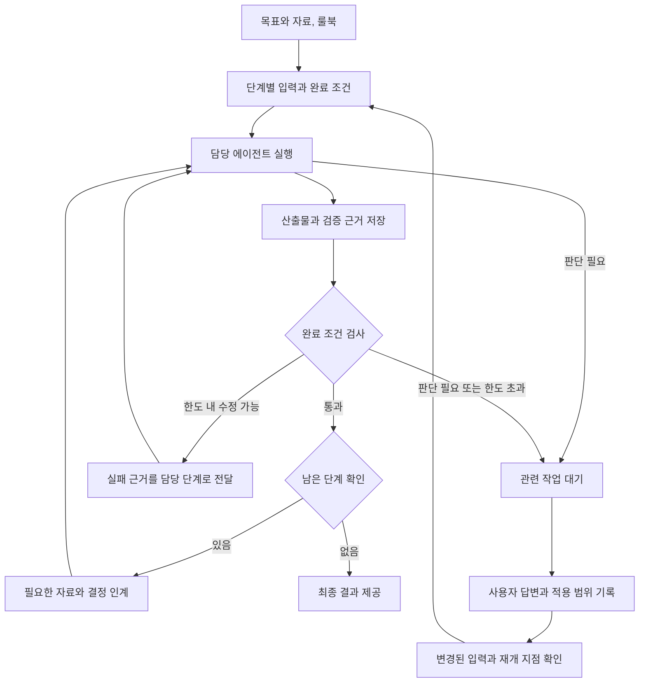

# 작업 오케스트레이션의 목적과 설계 근거

2026-09-19 기준. 이 문서는 사용자와 정리한 제품 목표, 공식 자료에서 확인한 원칙, 이를 프로젝트에 적용한 설계 제안과 검증 계획을 구분합니다. 아래 목표 구조는 아직 구현 완료된 계약이 아닙니다. 현재 동작은 [실행 계약](client-runtime.md), 기존 실행 하네스와의 관계는 [책임 경계](harness-architecture.md)를 참고하세요.

## 현재 단계와 해결하려는 문제

CODAST는 개인의 로컬 개발 환경에서 AI에게 맡긴 작업을 이어가는 방법을 탐색하고 검증하는 초기 프로젝트입니다. 세션과 실행 기록 등의 기반은 구현했지만, 단계별 자동 진행 방식과 개입 정책, 효과는 아직 검증 중이거나 미구현입니다. 이는 이 프로젝트의 개발 단계를 설명하며 AI 산업 전체가 태동기라는 주장은 아닙니다.

출발점은 여러 AI를 사용하면서 사람이 반복하는 인계 작업입니다. 설계 결과를 기다리고, 내용을 해석해 구현 지시서를 만들고, 구현 결과를 테스트 담당에게 전달하고, 실패 근거를 다시 개발 담당에게 보내는 과정입니다. 사용자는 대부분의 작업을 위임하되 중요한 판단에는 직접 개입하고자 합니다.

따라서 목표는 **품질과 필요한 사용자 통제를 유지하면서 작업 사이를 연결하는 사람의 수고를 줄이는 것**입니다. 시각화, 보고서, 화면 시안 등은 작업에 따라 선택하는 산출물입니다. 이들의 생성 기능 자체를 제품의 필수 조건으로 두지 않습니다. 다만 다음 작업에 필요한 설계와 코드, 검증 근거의 출처와 버전을 연결하는 기능은 핵심입니다.

## 공식 자료에서 가져온 기준

아래 자료는 2026-09-19 확인했습니다. 업체의 권고나 사례가 CODAST의 특정 구조를 의무화하거나 구현의 정확성을 증명하는 것은 아닙니다.

| 자료 | 확인한 내용 | 적용과 한계 |
| --- | --- | --- |
| [OpenAI: Codex as a platform](https://developers.openai.com/blog/codex-as-a-platform) | 실행 하네스와 이를 사용하는 제품의 책임을 구분 | 모델과 도구의 실행 루프는 기존 에이전트에 맡기고 제품은 작업 맥락과 진행을 관리. 특정 연결 인터페이스로의 교체를 뜻하지 않음 |
| [OpenAI: Orchestration and handoffs](https://developers.openai.com/api/docs/guides/agents/orchestration) | 전문가에게 제어권을 넘기는 방식과 중앙에서 전문가를 호출하는 방식을 구분. 역할 분리는 실제 이득이 있을 때 추가 | CODAST가 전체 진행 책임을 유지하도록 제안. 반드시 중앙 관리용 LLM이나 Agents SDK가 필요하다는 의미는 아님 |
| [Anthropic: Building effective agents](https://www.anthropic.com/engineering/building-effective-agents) | 정해진 코드 경로의 워크플로와 모델이 진행을 결정하는 에이전트를 구분. 단계 사이에 프로그램 검사를 둘 수 있음 | 우선 정해진 개발 단계를 코드로 연결하고 단계 내부는 에이전트에 위임. 동적 작업 분해는 필요성이 확인된 후 검토 |
| [Anthropic: Effective harnesses for long-running agents](https://www.anthropic.com/engineering/effective-harnesses-for-long-running-agents) | 진행 기록과 점진적인 작업, 검증을 통해 세션을 넘나드는 작업을 구성 | 대화 기억에만 의존하지 않고 산출물과 진행 근거를 남김. 사례의 파일 구성 전체를 그대로 도입하지 않음 |
| [Anthropic: Harness design for long-running apps](https://www.anthropic.com/engineering/harness-design-long-running-apps) | 계획, 생성, 평가 역할과 실제 환경을 사용한 검증 사례 | 구현과 평가의 역할을 분리하는 후보 근거. 여러 AI의 사용이나 반복 횟수 증가 자체가 품질을 보장하지 않음 |
| [Anthropic: Demystifying evals for AI agents](https://www.anthropic.com/engineering/demystifying-evals-for-ai-agents) | 에이전트의 주장과 실제 결과를 구분하고 평가 기준과 실행 환경을 관리 | 완료 선언보다 테스트와 환경의 결과를 확인. AI 평가도 별도 보정과 사람의 표본 검토가 필요 |
| [Anthropic: Managed Agents](https://www.anthropic.com/engineering/managed-agents) | 세션, 하네스, 샌드박스를 분리하는 관리형 실행 기반 | 기록과 실행 주체를 분리하는 참고 사례. 개인용 로컬 도구에서 같은 운영 규모나 인프라를 구현하려는 목표는 아님 |

CLI와 MCP의 역할 및 토큰 비용에 관한 [MCP 공식 구조](https://modelcontextprotocol.io/docs/learn/architecture)와 [Anthropic의 MCP 효율 분석](https://www.anthropic.com/engineering/code-execution-with-mcp)은 [책임 경계 문서](harness-architecture.md)에 적용 범위를 정리했습니다. CLI 사용만으로 비용 절감을 주장하지 않습니다.

## 근거에서 도출한 설계 방향

다음은 위 자료와 사용자 요구를 결합한 설계 판단입니다. 세부 스키마와 정책은 구현 전 검토가 필요한 제안입니다.

| 판단 | 이유와 비교한 대안 | 적용 조건과 검증 |
| --- | --- | --- |
| 전체 단계와 상태 전이는 프로그램이 관리 | 정해진 개발 순서를 재현하고 개입 조건을 집행해야 함. 관리용 AI가 모든 전이를 자유롭게 결정하는 방식은 초기 범위에서 제외 | 각 단계 내부의 탐색과 구현은 AI에 위임. 같은 상태와 사건에 대해 허용된 전이만 발생하는지 확인 |
| 대화 복사 대신 필요한 산출물과 결정 기록을 인계 | 긴 대화에는 오래된 결정과 불필요한 내용이 섞임. 요약만 전달하면 근거가 사라질 수 있음 | 요약에 원문과 버전 참조를 연결하고 누락된 요구사항과 인계 비용을 측정 |
| 정상 종료와 목표 달성을 구분 | 에이전트의 완료 선언이나 프로세스 종료만으로 요구사항 충족을 알 수 없음 | 해당 코드 버전의 테스트와 검토 근거를 확인한 후 단계 통과. 확인하지 못한 조건은 미검증으로 유지 |
| 정보 질문, 승인, 알림, 차단을 구분 | 모든 상황에서 멈추면 위임 효과가 사라지고, 모두 알림으로 처리하면 필요한 판단을 놓침 | 사용자 답변이 필요한 작업만 대기. 무응답은 승인으로 처리하지 않으며 개입 누락과 불필요한 중단을 함께 측정 |
| 재개 지점과 재작업 한도를 저장 | 중단 후 처음부터 재실행하거나 실패를 무한 반복하는 문제를 줄여야 함 | 재시작 후 파일과 실행 상태를 대조. 결과 불명 실행을 무조건 재시도하지 않고 횟수와 시간 한도를 확인 |
| 역할과 모델 배정은 우선 명시적으로 지정 | 자동 모델 선택의 우수성은 아직 입증하지 못함 | 한 에이전트로 처리하는 기준선과 비교하고 실제 이득이 있는 역할 분리만 유지 |

## 목표 실행 구조

코다스트는 이 흐름의 상태와 정책, 기록을 관리합니다. Codex와 Claude Code는 맡은 단계에서 모델과 도구를 사용합니다. 진행 UI는 현재 단계뿐 아니라 멈춘 이유, 필요한 결정, 완료 근거와 재개 지점을 보여주는 것을 목표로 합니다.

### 단계별 작업 계약과 인계

단계에는 목표, 담당 에이전트와 모델, 입력 자료의 버전, 허용 작업 범위, 예상 산출물, 완료 조건, 실패 시 돌아갈 단계가 필요합니다. 결과에는 산출물 위치와 버전, 변경 내용, 확정 결정, 미해결 문제, 검증 명령과 결과를 남깁니다. 구체적인 저장 형식은 미정입니다.

예를 들어 설계 단계가 API 명세 2판을 만들었다면 구현 단계가 어떤 판을 사용했는지 연결합니다. 이후 명세가 바뀌면 기존 구현과 검증을 그대로 유효하다고 간주하지 않고 영향받는 단계를 확인합니다. 시각화가 없는 작업도 동일한 인계 구조로 진행할 수 있어야 합니다.

### 검증과 사용자 개입

요구사항별 기대 동작을 기준으로 테스트와 검토를 수행합니다. 테스트 케이스는 구현 결과만 보고 맞춰 만들지 않도록 원래 요구사항과 연결합니다. 테스트 기준을 바꿔 통과한 경우 변경 이유와 영향을 남깁니다. 다른 AI의 평가도 근거 없이 최종 사실로 취급하지 않습니다.

룰북은 판단 기준을 제공하지만 프롬프트 전달만으로 강제 집행되지는 않습니다. 검사 가능한 전달 금지 조건과 실행 한도 등은 코드와 실행 권한 경계로 처리하고, 해석이 필요한 설계 변경은 근거를 갖춰 사용자에게 요청하도록 설계합니다. 현재 첨부 가드는 네이티브 CLI의 직접 파일 접근까지 통제하지 않습니다.

승인 요청에는 이유, 대안, 영향, 대상 작업과 산출물 버전, 승인 후 재개 위치를 포함하는 것을 제안합니다. 승인 뒤 대상이나 범위가 달라졌다면 이전 승인이 유효한지 다시 확인해야 합니다. 알림 확인과 사용자 승인은 별개입니다.

### 중단과 복구

단계 진행, 실행 시도, 산출물과 사용자 결정을 저장하고 재개 전에 현재 작업 파일과 대조합니다. 기존 요청 ID 중복 방지는 기반으로 활용하되 외부 CLI가 파일이나 외부 시스템에 만든 부작용까지 정확히 한 번만 발생한다고 확대 해석하지 않습니다. 프로세스 상태가 불명확하면 확인 단계를 거치며 취소가 파일 변경을 자동으로 되돌린다고 가정하지 않습니다.

## 첫 검증 범위와 개발 순서

첫 실험은 작은 기능 하나의 설계, 구현, 테스트, 수정, 사용자 답변 후 재개를 끝까지 연결하는 것입니다. 담당 모델은 사용자가 지정하고 프로젝트당 한 실행이라는 현재 제약 안에서 시작합니다. 동적 작업 분해, 범용 흐름 편집기, 분산 실행, 자동 모델 추천은 이 실험의 필수 조건이 아닙니다.

완료 기준은 정상 경로뿐 아니라 테스트 실패 후 제한된 재작업, 사용자 판단 대기와 답변 반영, 서버 재시작 후 상태 확인, 오래된 산출물 감지까지 포함합니다. 이는 제안한 첫 워크플로 검증 범위이며 기존 기반 작업의 우선순위를 자동으로 바꾸지 않습니다. 실행 어댑터나 저장 계약의 큰 변경은 별도 영향 검토가 필요합니다.

## 효과를 확인하는 방법

같은 시작 코드와 요구사항, 완료 기준으로 다음 세 조건을 비교합니다.

1. 한 에이전트에게 전체 작업을 맡기는 경우
2. 사람이 여러 에이전트 사이에서 결과를 정리하고 전달하는 경우
3. CODAST가 단계별 인계와 검증, 개입을 관리하는 경우

| 평가 항목 | 기록할 내용 |
| --- | --- |
| 결과 품질 | 요구사항 충족률, 동일한 테스트 결과, 남은 결함 |
| 사람의 부담 | 결과 해석과 인계에 쓴 실제 시간, 질문과 승인 처리 시간 |
| 개입의 적절성 | 필요한 판단을 놓친 횟수, 불필요하게 멈춘 횟수 |
| 인계와 복구 | 누락된 요구사항, 잘못된 버전 사용, 중복 작업, 올바른 재개 여부 |
| 총비용 | 전체 경과 시간, 추가 검증과 실패 재시도를 포함한 사용량, 확인 가능한 과금 |

모델과 버전, 권한, 사용 도구, 시작 파일, 네이티브 세션 재사용 조건을 기록합니다. 한 번의 성공을 일반화하지 않고 여러 과제와 반복 실행으로 편차를 확인합니다. 토큰 사용량과 실제 요금은 구분하고 수집되지 않은 값은 0으로 처리하지 않습니다. 개입 누락 여부는 사전에 정한 시나리오와 사람의 검토로 확인합니다.

현재 비교 실험은 미수행입니다. 여러 에이전트가 단일 에이전트보다 낫다는 결과도, 비용 절감 효과도 확정되지 않았습니다. 인계 비용이 이득보다 크다면 단계를 합치거나 같은 에이전트를 유지하는 방향으로 수정합니다.

## 현재 증거와 남은 질문

현재 설명할 수 있는 구현 성과는 [구현 노트](implementation-notes.md)에 연결된 세션 연속성, 요청 중복 방지, 복구와 첨부 가드입니다. 이 기록은 기반 기능의 증거이며 다단계 개발 자동화의 효과를 입증하지 않습니다.

남은 질문은 어떤 작업에서 역할 분리가 유리한지, 개입 조건을 얼마나 안정적으로 판별할 수 있는지, 재개 시 변경된 파일과 승인을 어떻게 대조할지, 기존 CLI 인터페이스로 필요한 통제를 제공할 수 있는지입니다. 결과에 따라 설계를 조정합니다. 프로젝트를 설명할 때는 문제와 설계 근거, 구현한 범위, 검증 결과, 미검증 가설을 순서대로 제시하고 목표를 성과로 바꾸어 표현하지 않습니다.
